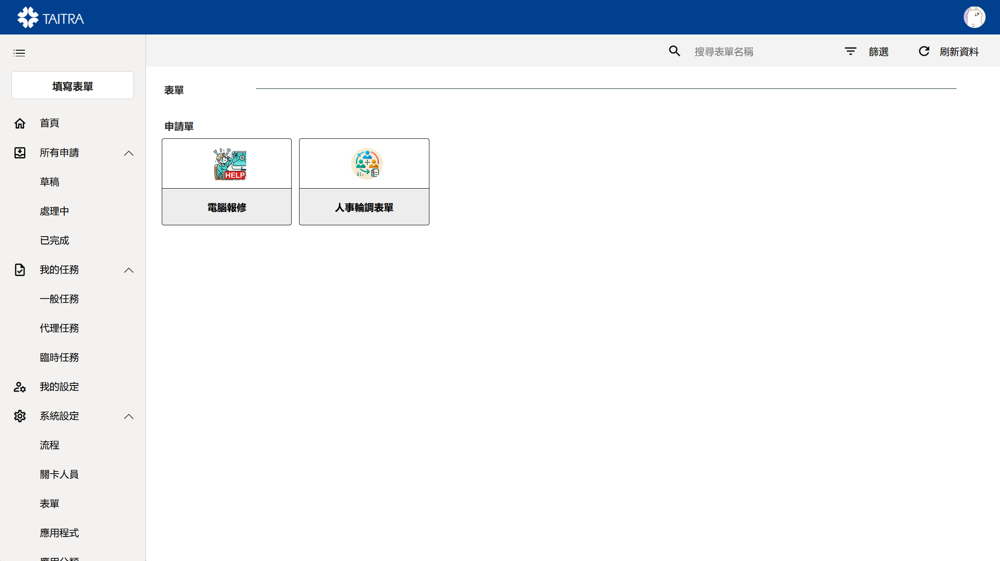

# Business Center Portal (業務中台)

## Project Overview
The Business Center Portal is a comprehensive workflow management solution built on Microsoft PowerPlatform (PowerApps, Power Automate, Dataverse). This application serves as a centralized hub for business process automation, enabling organizations to create custom forms, manage complex approval workflows, and streamline operational procedures across departments.

The solution consists of integrated components:
- A centralized management interface for administrators to configure forms, workflows, and approval chains
- Dynamic form creation system that adapts to various business requirements
- Multi-level approval engine with conditional routing
- Real-time dashboard for monitoring workflow status

## Key Features

- **Dynamic Form Builder**: Create and customize forms with drag-and-drop functionality, supporting various field types, validation rules, and conditional logic.

- **Intelligent Approval Engine (審核引擎)**: Configure multi-step approval workflows with conditional routing based on request type, amount, department, or custom business rules.

- **Request Tracking and Status**: Provide real-time visibility into request progress with detailed audit trails and status updates for all stakeholders.
  

## Technical Implementation
The Business Center Portal was developed using Microsoft's PowerPlatform suite:
- **PowerApps**: Delivers responsive web and mobile interfaces with custom form rendering and workflow visualization
- **Power Automate**: Powers the approval engine with complex conditional logic, automated notifications, and system integrations
- **Dataverse**: Provides secure, scalable data storage with advanced relationship modeling for forms, workflows, and audit trails
